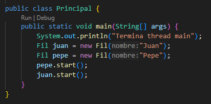
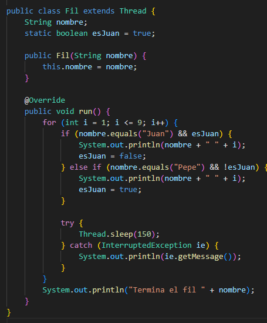
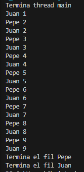

# ACT-01 THREADS

## <u>Primera ejecución</u>:

Código del **primer comportamiento**:

   
  

Ejecución del **primer comportamiento**:

  

 

## <u>Segunda ejecución</u>:

Código del **segundo comportamiento**:

   
  

Ejecución del **segundo comportamiento**:

  

 

## <u>Tercera ejecución</u>:

Código del **tercer comportamiento**:

   
  

Ejecución del **tercer comportamiento**:

  

