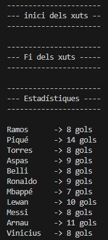
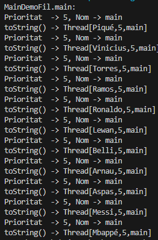

# **ACT02-FUTBOL**

## <u>PRIMERA PARTE</u>:

En este ejercicio se creó una clase con el nombre **Futbolista** que heredó la clase **Thread**. También se creó un **Main**, donde se inicializará las instancias de los futbolistas y se iniciarán.

📌 **Nota:** En esta clase no pude ver donde utilizar los atributos **NUM_JUGADORES** y **ntirades**.  Debido a que no le veo utilidad a "ntirades" si no se muestra por pantalla y lo mismo con "NUM_JUGADORES" ya que lo inicializo directamente en el main.

### Clase Futbolista:

El objetivo de esta clase es que cada hilo, que este caso representa un jugador, tendrá 20 tiros con un 50% de posibilidad para marcar goles y el resultado se mostrará por pantalla con el nombre del jugador y cuantos goles acertó.

Para obtener el nombre del jugador, creé un constructor que tenga como parámetro el nombre del jugador y lo envío con el **super** al constructor de Thread.

Al realizar eso, solamente debemos llamar al getter **getName()** de la clase Thread, que contendrá le nombre del jugador que se le pasó como argumento al inicializarlo en el Main.

En el **método run** creé un **for** iterando el numero de tiros por cada jugador y dentro hice una **condición** con el **método random** de la **clase Math** para aumentar los goles si acierta con el 50% de posibilidad que tienen.

Por último se muestra por pantalla.

### Clase main

Es esta clase declaro e inicializo un **String[]** que contendrá el nombre de los 11 jugadores.

Luego declaro e inicializo un **Arraylist** que **almacenará** objetos de la clase **Futbolistas**.

Seguidamente creo un **for-each** que iterará cada nombre que contenga el array de String, y con cada nombre se lo paso como argumento para así creo una instancia de la clase Futbolista (creo 11 hilos). De seguido los inicio con el **método start** de **Thread** y además añado a la lista cada instancia creada de Futbbolista.

Para así despues iterar el Arraylist con un **for-each** y empezar cada hilo hasta que termine para seguir con el siguiente, eso se logra gracias al método **join()** de Thread.

**Imágen de salida:**

   

 

## <u>SEGUNDA PARTE</u>:

Esta clase será un **segundo Main** que demostrará que los programas que hice se ejecutan el un hilo. 

Primero para obtener el nombre del hilo debemos inicializar un ojbeto Thread con su método **curretnThread()**, este método devuelve el hilo que se está ejecutando actualmente.

Una vez que ya se haya obtenido el hilo, obtendremos su nombre con el método **getName()**.

Para saber la prioridad de todos los futbolistas y su toString(), solo creé los futbolistas como en el Main anterior, con un Array con el nombre de los 11 futbolistas. 

📌 **Nota:** Con esto supe que cada hilo por defecto se crea con un 5/10 de prioridad.

Para saber la prioridad de cada hilo, llamé al método **getPriority()** y con el **toString()** se puede saber el: **nombre del hilo**, la **prioridad** y el **nombre grupo de hilos**.

**Imágen de salida:**

   

